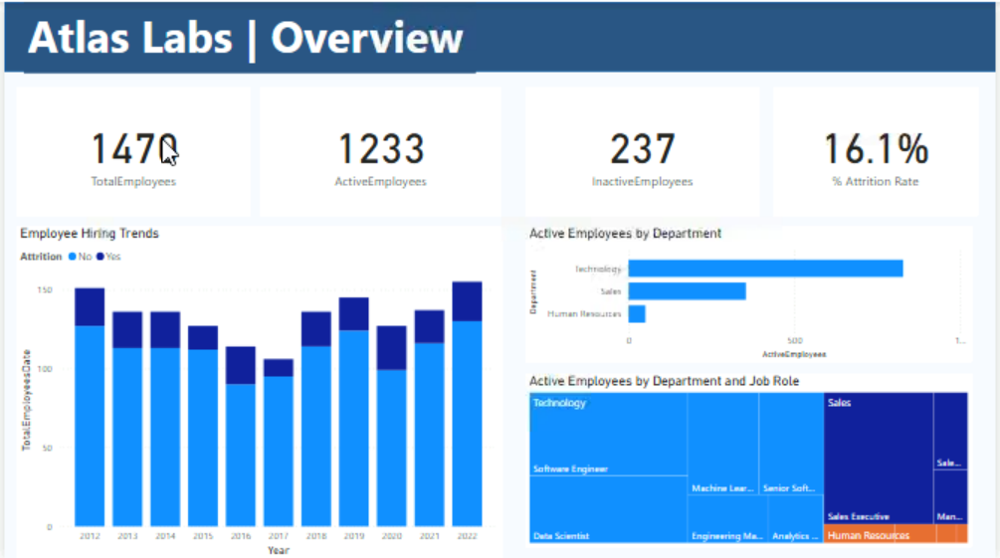
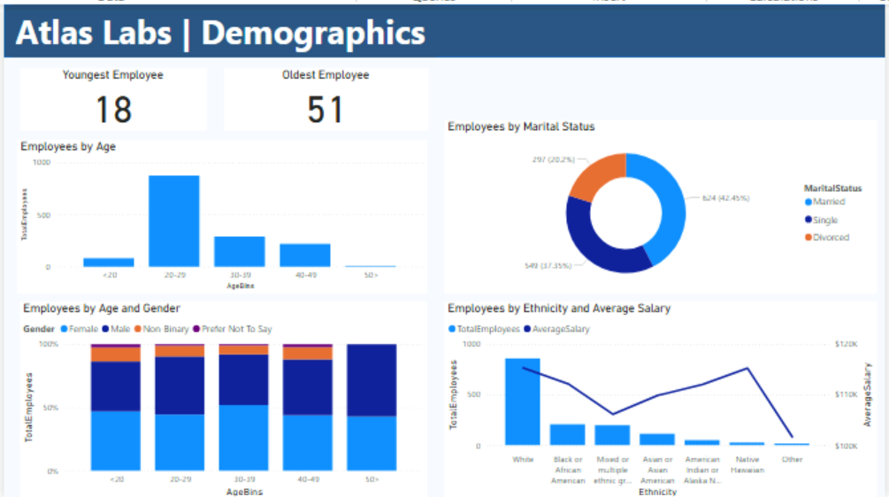
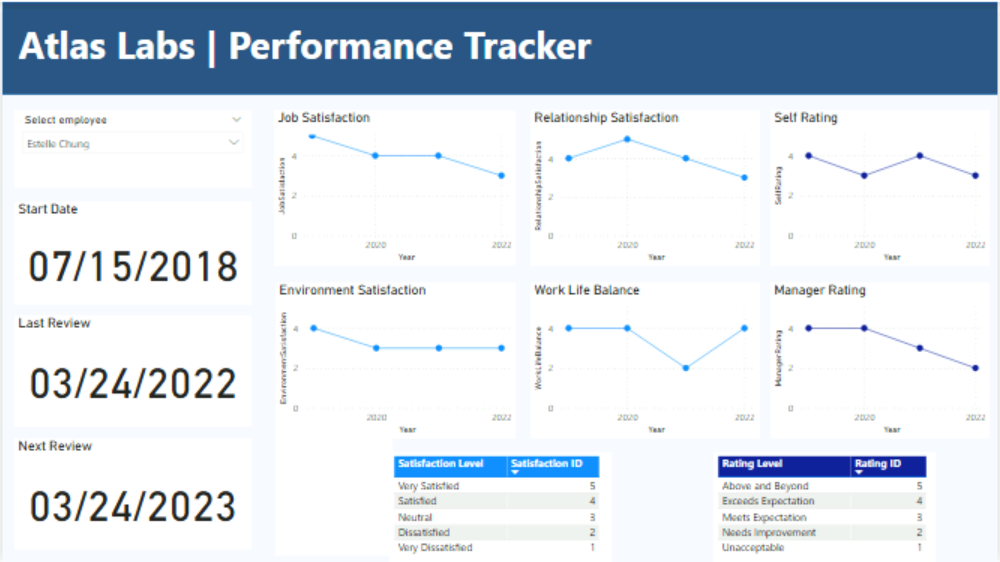

# atlas-labs-hr-analytics-power-bi
# Atlas Labs | HR Analytics Dashboard (Power BI)

A 4-page Power BI report analyzing workforce composition, demographics, performance, and attrition for a fictitious software company, **Atlas Labs**. Built as a case study to practice data modeling, DAX, and dashboard storytelling for HR analytics; a domain that translates directly to retention and workforce-planning problems in any industry, including banking and financial services.

> **Skills demonstrated:** data modeling (star schema, active/inactive relationships), DAX measures (CALCULATE, FILTER, USERELATIONSHIP, VAR/RETURN, DIVIDE), custom binning, interactive report design, and translating metrics into a business narrative.

---

## Business problem

Atlas Labs wants to understand *who* its employees are, *how satisfied* they are, and — most importantly — *why people are leaving*. The report is built to answer three questions leadership actually cares about:

1. What does our current workforce look like (headcount, department mix, demographics)?
2. How are individual employees performing, and how satisfied are they over time?
3. Where is attrition concentrated, and what conditions correlate with people leaving?

---

## Page 1 — Overview



**What it shows:** total headcount, active vs. inactive employees, overall attrition rate, hiring trends by year, and how active employees are distributed across departments and job roles.

**Key numbers:**
- **1,470** total employees hired over the company's history
- **1,233** currently active, **237** inactive → a **16.1%** overall attrition rate
- **Technology** is by far the largest active department, followed by **Sales**, then **Human Resources**, Technology alone holds roughly 3x the headcount of Sales
- Hiring has been volatile rather than steadily growing: strong hiring years (e.g. 2012, 2019, 2022) are followed by noticeable dips (e.g. 2016–2017), suggesting Atlas Labs' hiring has tracked business cycles or specific growth pushes rather than a smooth headcount ramp

**Visuals and measures:**

| Visual | Type | Fields |
|---|---|---|
| Total Employees | Card | `TotalEmployees` |
| Active Employees | Card | `ActiveEmployees` |
| Inactive Employees | Card | `InactiveEmployees` |
| % Attrition Rate | Card | `% Attrition Rate` |
| Employee Hiring Trends | Stacked column | X: `DimDate[Date]` · Y: `TotalEmployeesDate` · Legend: `DimEmployee[Attrition]` |
| Active Employees by Department | Clustered bar | Y: `DimEmployee[Department]` · X: `[ActiveEmployees]` |
| Active Employees by Department and Job Role | Treemap | Category: `DimEmployee[Department]` · Details: `DimEmployee[JobRole]` · Values: `[ActiveEmployees]` |

**DAX:**

```dax
ActiveEmployees =
CALCULATE ( [TotalEmployees], FILTER ( DimEmployee, DimEmployee[Attrition] = "No" ) )

InactiveEmployees =
CALCULATE ( [TotalEmployees], FILTER ( DimEmployee, DimEmployee[Attrition] = "Yes" ) )

% Attrition Rate =
DIVIDE ( [InactiveEmployees], [TotalEmployees] )
```

---

## Page 2 — Demographics



**What it shows:** the age, gender, marital status, and ethnicity makeup of the workforce, plus how average salary varies by ethnicity.

**Key numbers:**
- Employee ages range from **18 to 51**
- The workforce skews young: the **20–29** age band is by far the largest group, roughly triple the size of any other age bracket
- By marital status: **624 Married**, **549 Single**, **297 Divorced** employees
- Gender mix shifts with age, the youngest band (<20) is almost entirely female, while older bands trend more evenly split between female and male, with a small share identifying as non-binary or preferring not to say
- **White** employees make up the large majority of headcount, with all other ethnicity groups considerably smaller
- Average salary doesn't track headcount; the largest group (White) doesn't earn the most on average, and average salary actually peaks for one of the smallest groups, dipping again for the smallest group of all. This kind of pay-vs-representation gap is exactly the sort of pattern an HR/DEI review would want flagged and investigated further.

**Visuals and measures:**

| Visual | Type | Fields |
|---|---|---|
| Youngest Employee | Card | `DimEmployee[Age]` (Min) |
| Oldest Employee | Card | `DimEmployee[Age]` (Max) |
| Employees by Age | Stacked column | X: `AgeBins` |
| Employees by Marital Status | Donut | Legend: `DimEmployee[MaritalStatus]` · Values: `[TotalEmployees]` |
| Employees by Ethnicity and Average Salary | Line + stacked column | X: `DimEmployee[Ethnicity]` · Column Y: `TotalEmployees` · Line Y: `AverageSalary` |

**DAX / calculated column — Age Bins:**

```dax
AgeBins =
SWITCH (
    TRUE (),
    DimEmployee[Age] < 20, "<20",
    DimEmployee[Age] >= 20 && DimEmployee[Age] <= 29, "20-29",
    DimEmployee[Age] >= 30 && DimEmployee[Age] <= 39, "30-39",
    DimEmployee[Age] >= 40 && DimEmployee[Age] <= 49, "40-49",
    DimEmployee[Age] >= 50, "50+"
)
```
*(bucket boundaries shown as used in the report — adjust here if your version defined them differently)*

---

## Page 3 — Performance Tracker



**What it shows:** a per-employee drill-down, selectable by name, of satisfaction and rating trends over time, plus start date, last review date, and a calculated next review date.

**Example:** for employee **Estelle Chung** (start date 07/15/2018, last review 03/24/2022, next review 03/24/2023), job satisfaction, relationship satisfaction, and manager rating all trend **downward** toward the most recent review, while self-rating stays relatively flat and work-life balance dips sharply mid-period before partially recovering. That divergence, a manager's assessment declining while the employee's self-assessment holds steady, is a classic early warning sign worth a 1:1 conversation, and it's the kind of individual-level insight a page like this is built to surface before it shows up as an attrition statistic on Page 4.

**Visuals and measures:**

| Visual | Type | Fields |
|---|---|---|
| Select employee | Slicer | `FullName` |
| Start Date | Card | `DimEmployee[HireDate]` |
| Last Review | Card | `LastReviewDate` |
| Next Review | Card | `NextReviewDate` |
| Job Satisfaction | Line | X: `DimDate[Year]` · Y: `[JobSatisfaction]` |
| Relationship Satisfaction | Line | X: `Year` · Y: `[RelationshipSatisfaction]` |
| Self Rating | Line | X: `Year` · Y: `[SelfRating]` |
| Environment Satisfaction | Line | X: `Year` · Y: `[EnvironmentSatisfaction]` |
| Work Life Balance | Line | X: `Year` · Y: `[WorkLifeBalance]` |
| Manager Rating | Line | X: `Year` · Y: `[ManagerRating]` |
| Satisfaction Level lookup | Table | `Satisfaction Level`, `Satisfaction ID` |
| Rating Level lookup | Table | `Rating Level`, `Rating ID` |

**DAX:**

```dax
FullName = DimEmployee[FirstName] & " " & DimEmployee[LastName]

LastReviewDate =
IF (
    MAX ( FactPerformanceRating[ReviewDate] ) = BLANK (),
    "No Review Yet",
    MAX ( FactPerformanceRating[ReviewDate] )
)

NextReviewDate =
VAR reviewOrHire =
    IF (
        MAX ( FactPerformanceRating[ReviewDate] ) = BLANK (),
        MAX ( DimEmployee[HireDate] ),
        MAX ( FactPerformanceRating[ReviewDate] )
    )
RETURN
    reviewOrHire + 365

JobSatisfaction = MAX ( FactPerformanceRating[JobSatisfaction] )

RelationshipSatisfaction =
CALCULATE (
    MAX ( FactPerformanceRating[RelationshipSatisfaction] ),
    USERELATIONSHIP ( FactPerformanceRating[RelationshipSatisfaction], DimSatisfiedLevel[SatisfactionID] )
)

SelfRating =
CALCULATE (
    MAX ( FactPerformanceRating[SelfRating] ),
    USERELATIONSHIP ( FactPerformanceRating[SelfRating], DimRatingLevel[RatingID] )
)

EnvironmentSatisfaction =
CALCULATE (
    MAX ( FactPerformanceRating[EnvironmentSatisfaction] ),
    USERELATIONSHIP ( FactPerformanceRating[EnvironmentSatisfaction], DimSatisfiedLevel[SatisfactionID] )
)

WorkLifeBalance =
CALCULATE (
    MAX ( FactPerformanceRating[WorkLifeBalance] ),
    USERELATIONSHIP ( FactPerformanceRating[WorkLifeBalance], DimSatisfiedLevel[SatisfactionID] )
)

ManagerRating =
CALCULATE (
    MAX ( FactPerformanceRating[ManagerRating] ),
    USERELATIONSHIP ( FactPerformanceRating[ManagerRating], DimRatingLevel[RatingID] )
)
```

*Note: `EnvironmentSatisfaction` and `WorkLifeBalance` both use `USERELATIONSHIP` against inactive relationships in the model, since `FactPerformanceRating` has multiple satisfaction/rating columns that all need to relate back to the same lookup tables (`DimSatisfiedLevel`, `DimRatingLevel`) without conflicting with the model's single active relationship.*

---

## Page 4 — Attrition


**What it shows:** the same 16.1% headline attrition rate, broken down by department/job role, business travel frequency, overtime requirement, hire year, and tenure — the page built to answer "where should retention efforts focus first?"

**Key insights:**
- **Sales roles dominate attrition.** Sales Representatives and Sales Executives show the two highest attrition rates by department/job role — both well above the company-wide 16.1% average, with Technology roles (Machine Learning Engineer, Senior Software Engineer, Analytics) sitting at the low end.
- **Overtime is the single starkest split in the whole report.** Employees who work overtime show a dramatically higher attrition rate than those who don't — this is the clearest "if you fix one thing" signal in the dashboard.
- **Frequent travelers churn more.** Attrition rate is highest for employees who travel frequently, drops for those who travel occasionally, and is lowest for employees who don't travel for work at all.
- **Attrition is a new-hire problem.** Attrition rate is highest in an employee's first two years at the company and then steadily declines with tenure — people who make it past the ~2-year mark are considerably more likely to stay. This, combined with the overtime finding, suggests onboarding workload and early burnout are worth investigating together.
- **Attrition by hire year is noisy rather than trending**, spikes around 2016 and 2020 stand out, which lines up with the hiring dip seen on the Overview page and is worth cross-referencing against company events in those years (layoffs, reorgs, market conditions).

**Visuals and measures:**

| Visual | Type | Fields |
|---|---|---|
| % Attrition Rate | Card | `% Attrition Rate` |
| % Attrition Rate by Department and JobRole | Column | X: `Department`/`JobRole` · Y: `% Attrition Rate` |
| Attrition by Hire Date | Line | X: `Year` · Y: `% Attrition Rate` |
| Attrition by Travel Frequency | Line + stacked column | X: `BusinessTravel` · Column Y: `% Attrition Rate` · Line Y: `TotalEmployees` |
| Attrition by Overtime Requirement | Stacked column | X: `OverTime` · Y: `% Attrition Rate` |
| Attrition by Tenure | Stacked column | X: `YearsAtCompany` · Y: `% Attrition Rate` |

**DAX:**

```dax
InactiveEmployeesDate =
CALCULATE ( [InactiveEmployees], USERELATIONSHIP ( DimEmployee[HireDate], DimDate[Date] ) )

% Attrition Rate Date =
DIVIDE ( [InactiveEmployeesDate], [TotalEmployeesDate] )
```

*`InactiveEmployeesDate` and `% Attrition Rate Date` exist because `DimEmployee[HireDate]` isn't the model's active relationship to `DimDate` — this pattern (an inactive relationship activated per-visual with `USERELATIONSHIP`) shows up repeatedly across the report and is the main modeling technique this case study is built to teach.*

---

## Tools

- **Power BI Desktop** — data modeling, DAX, report design
- **DAX** — CALCULATE, FILTER, DIVIDE, USERELATIONSHIP, SWITCH(TRUE()), VAR/RETURN

## Data model notes

The model is a star schema centered on `FactPerformanceRating`, with `DimEmployee` and `DimDate` as the primary dimensions, plus `DimSatisfiedLevel` and `DimRatingLevel` as lookup tables for satisfaction/rating labels. Several measures deliberately activate an otherwise-inactive relationship with `USERELATIONSHIP` rather than changing the model's default active relationships, this keeps the default date-based reporting intact (using `DimDate[Date]` against transaction/review dates) while still allowing hire-date-based and multi-column-based analysis where needed.

## About this project

Built as a hands-on case study to apply and demonstrate Power BI skills — data modeling, DAX measure design, and dashboard storytelling — using the Atlas Labs HR dataset.
